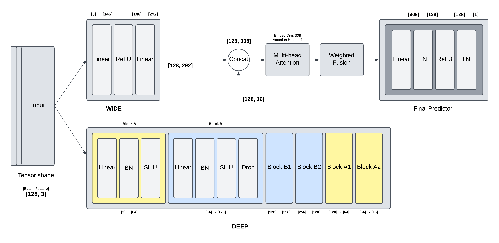

# Deep Learning Wide & Deep Regression Model - Kaggle Competition

> **Note:** This competition was a part of the coursework for Deep Learning (CSE641) at IIIT Delhi, taught by Dr. Vinayak Abrol in the Winter 2025 semester.

## Competition Results
- **Rank**: 4th out of 74 participants
- **Final Error on Test Set**: 3.9981
- **Competition**: Kaggle Regression Challenge

## Project Overview
This project implements a sophisticated deep learning regression model using PyTorch to predict continuous output values from three input features (F1, F2, F3). The model achieved exceptional performance in a competitive Kaggle environment, demonstrating the effectiveness of advanced neural network architectures for regression tasks.

**The competition explicitly prohibited any external data preprocessing, feature scaling, or normalization of the input data. This constraint made the challenge significantly more difficult, as the raw features had vastly different scales and distributions.**

## Model Architecture

The model employs a **Wide & Deep with Attention** architecture that combines:

### Wide Path (Feature Interactions)
- Processes input features through wider layers (146 → 292 neurons)
- Captures complex feature interactions and non-linear relationships
- Uses ReLU activation for robust feature transformation

### Deep Path (Hierarchical Features)
- Multi-layered deep network (64 → 128 → 256 → 128 → 64 → 16 neurons)
- Implements **Batch Normalization** at each layer for stable training
- Uses **SiLU (Swish)** activation functions for better gradient flow
- Strategic dropout layers (0.1, 0.2, 0.2, 0.1) to prevent overfitting

### Attention Mechanism
- **Multi-head Attention** with 4 heads
- Processes combined wide and deep features
- Embedding dimension: 308 (16 + 292)
- Enhances feature importance weighting

### Feature Fusion
- Combines wide and deep paths with attention output
- Weighted combination: 60% direct features + 40% attention output
- Final prediction through dense layers with Layer Normalization

## Key Technical Features

### Data Handling
- **Train/Validation Split**: 90/10 split for robust evaluation
- **Batch Processing**: 128 samples per batch for optimal GPU utilization

### Training Strategy
- **Weight Initialization**: Orthogonal initialization for better gradient flow
- **Optimizer**: Adam with learning rate 5e-4 and weight decay 1e-4
- **Learning Rate Scheduling**: ReduceLROnPlateau with factor 0.5 and patience 5
- **Early Stopping**: Model checkpointing based on validation MSE

### Regularization Techniques
- **Batch Normalization**: Addresses feature scale differences without preprocessing
- **Dropout**: Progressive dropout rates (0.1 → 0.2 → 0.2 → 0.1)
- **Weight Decay**: L2 regularization to prevent overfitting

## Performance Metrics

### Training Progress
- **Total Epochs**: 100
- **Best Validation MSE**: 4.1941 (achieved at epoch 28)
- **Final Training MSE**: ~4.08
- **Convergence**: Stable training with consistent improvement

### Model Evaluation
- **Loss Function**: Mean Squared Error (MSE)
- **Evaluation Metric**: Root Mean Square Error
- **Cross-validation**: Robust train/validation split strategy
